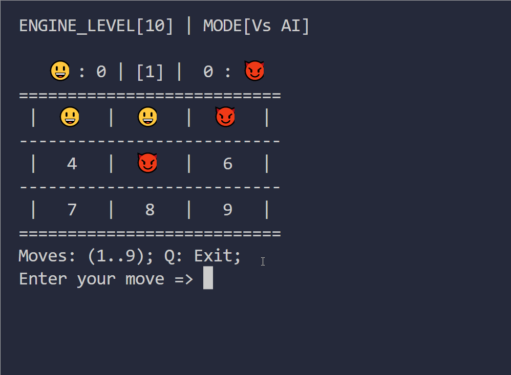
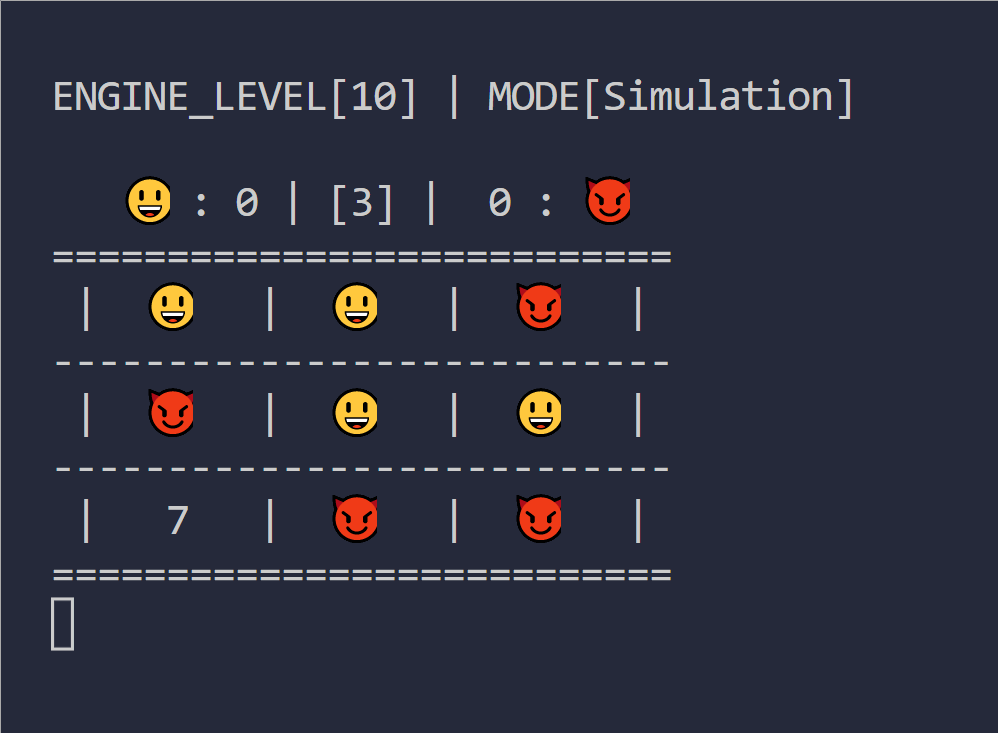

# Tictactoe - MCTS 

This Tictactoe engine uses Monte Carlo Tree Search algorithm to find the best move. The algorithm builds a game tree and simulates many random games to evaluate the possible outcomes, which are then used to guess the optimal play. 

This tree search can be used with reinforcement learning to improve AI decision making process. MCTS has been used by Google Deepmind's AI systems like Alpha Go/Zero which can play the board game GO at a superhuman level.


## Screenshots




## Features

- Easily integrateable `Tictactoe` class
- MCTS algorithm implementation
- Modes: Human vs AI, AI vs AI simulation
- Levels: 1..10
- Board Sizes: 3..6
- Simple command-line interface

## Algorithm

MCTS uses random simulations and tree search to explore the search space. The algorithm collects data from results and guesses the best move. The algorithm has to be run multiple times to get the optimal guess. It's usually controlled by a **run time** or **depth** variable. The longer or the more loops it runs, the better the output.

The output is a probability distribution of actions. As in the case of **3x3** Tictactoe board, it would be like this: 

- `[0.01, 0.35, 0.3, 0.0, 0.0, 0.3, 0.8, 0.0, 0.1]`

If it gets the above output, it will play at `square 6` since it has the highest winning chance. 


The algorithm involves the following steps:

### 1. Selection
Selection starts at the root and selects child nodes untill it reaches a leaf node or a node that has not been fully expanded, i.e., all legal moves have been played for that node.

UCB score is used to find the best node to expand next. It's calculated with:
- `reward + exploration bonus` 
  
Common formula for *exploration bonus* is 
- `C * sqrt(log(total_visits_to_parent)/visits_to_child)` 
  - where C is parameter to controls the amount of exploration

### 2. Expansion
When a node does not have a child node for every possible move, a new node is added to the selected node for the next move which is chosen randomly from the legal moves.

### 3. Simulation
The algorithm plays the game from current node by making random moves until gameover. The result is used to compute a reward (1 for win, -1 for loss, 0 for draw) which is then propagated back to the root.

### 4. Backpropagation
After a simulation, the algorithm updates the visit count and value of  each node. Visit count is increased by 1 and the value sum is updated based on the outcome of simulation. This process continues until it reaches the root.

## Run Locally

To run the TicTacToe engine locally, you will need to have Ruby installed on your system. 

Once you have Ruby installed, follow these steps:

1. Clone this repository to your local machine
2. Navigate to the project directory in your terminal
3. Run `ruby main.rb` to start the game

## Options

The game will start in human vs computer mode by default. You can switch to computer vs computer mode by passing the `--mode computer` flag when starting the game.

Here are all the available options to run the program.

```sh
$ ruby main.rb -h
Usage: main [options]
    -m, --mode MODE                  Choose mode (vsai, computer) Def:vsai
    -l, --level AI_LEVEL             Choose AI level (1..10) Def:10       
    -z, --size BOARD_SIZE            Change board size (>=3) Def:3
    -h, --help                       Prints this help
```

## Acknowledgements

- [Monte Carlo Tree Search Explained](https://int8.io/monte-carlo-tree-search-beginners-guide/)

## License
This project is [MIT](./LICENSE) licensed.


